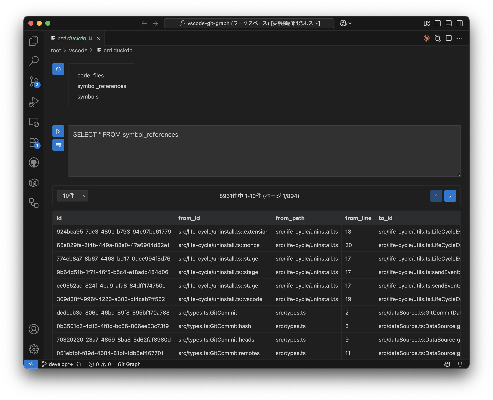

# DuckDB Editor for VSCode

DuckDBファイル（.db, .duckdb）を直接VSCodeで開いて、SQLクエリを実行できるカスタムエディタ拡張機能です。  
単体で動作します。外部のツールをインストールする必要はありません。  



## 特徴

- 📊 **視覚的なDBエディタ** - DuckDBファイルを直接VSCodeで開ける
- 🔍 **テーブル一覧表示** - データベース内のテーブルを素早く確認
- ⚡ **SQLクエリ実行** - リアルタイムでSQLを実行し結果を表示
- 📄 **ページング機能** - 大量データも快適に閲覧（10/25/50/100件表示）
- 🎨 **VSCodeテーマ対応** - ダークモード・ライトモード両対応
- 🖱️ **直感的UI** - アイコンボタンとスクロール可能なテーブル表示

## インストール

1. VSCodeを開く
2. 拡張機能タブ（`Ctrl+Shift+X`）を開く
3. 検索バーで「**DuckDB Editor for VSCode**」を検索
4. インストールボタンをクリック

### 開発者向け

開発環境でテストする場合：

```bash
git clone <repository-url>
cd vscode-duckdb-editor
npm install
npm run compile
# F5キーでExtension Development Hostを起動
```

## 使い方

1. **DuckDBファイルを開く**
   - `.db`または`.duckdb`ファイルを右クリック
   - "Open with..." → "DuckDB Editor"を選択

2. **テーブル参照**
   - 左上の更新ボタン（🔄）でテーブル一覧を取得
   - テーブル名をクリックで自動的にSELECTクエリを挿入

3. **SQLクエリ実行**
   - テキストエリアにSQLを入力
   - 再生ボタン（▶️）でクエリ実行
   - 消去ボタン（🗑️）でクエリクリア

4. **結果の閲覧**
   - 結果は固定ヘッダー付きの表で表示
   - ページサイズを選択（10/25/50/100件）
   - 前後ページボタンで大量データもスムーズに閲覧

## 対応ファイル

- `.db` - SQLiteデータベース
- `.duckdb` - DuckDBデータベース

## 要件

- Visual Studio Code 1.74.0以上
- Node.js（開発時）

## ライセンス

MIT License
